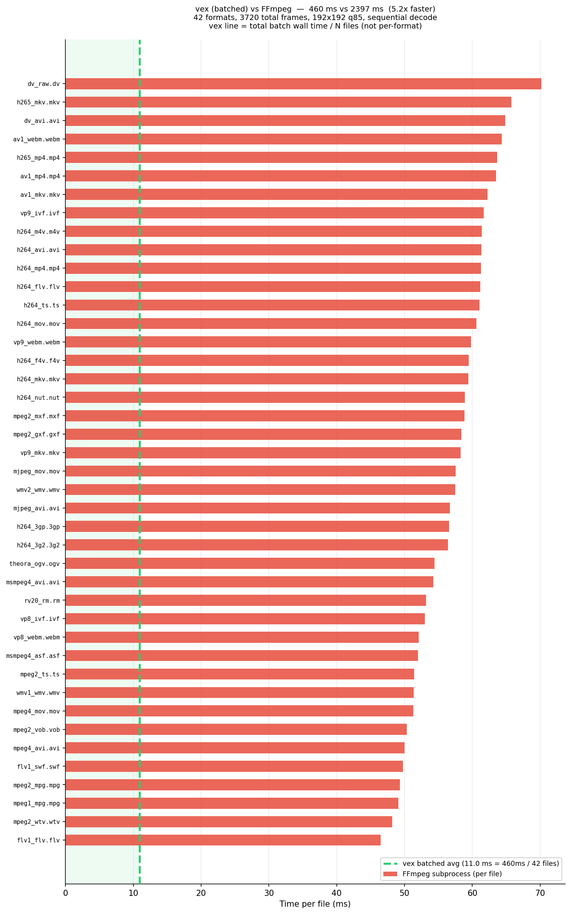
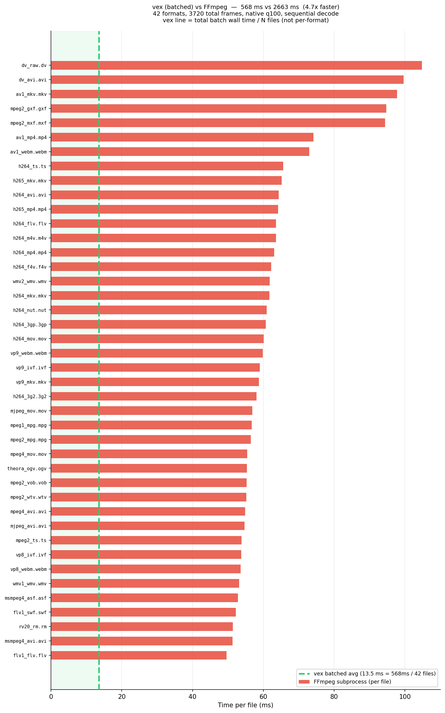
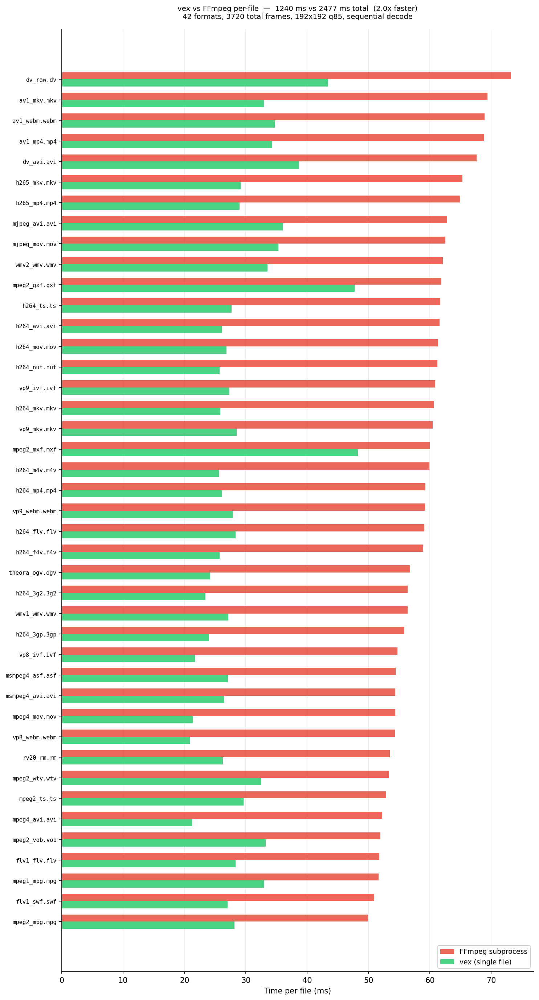
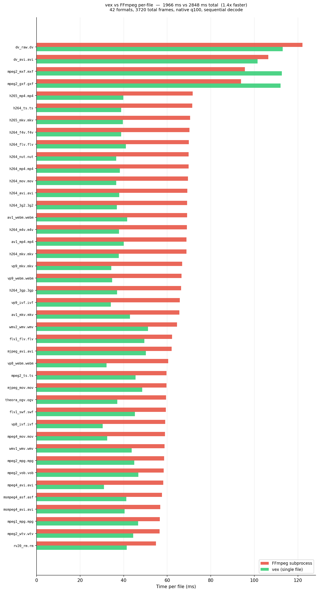

# vex

Zero-copy, in-process video image extraction built for maximum decode speed.

vex links directly against FFmpeg's `libavcodec`/`libavformat`/`libswscale` and TurboJPEG to decode, scale, and JPEG-encode keyframes entirely in-process — no subprocess spawning, no shell pipes, no intermediate files. Decoded frames flow through a single pipeline where each stage operates on raw pointers, eliminating serialization overhead and unnecessary copies.

## Benchmark

### Batched throughput

vex batch-decodes all frames from 42 container formats in a single `batch_decode` call. The dashed line is the **amortized average** (total wall time / N files) — not per-format timing. FFmpeg bars show actual per-file wall time (one subprocess each).

**Thumbnail** — 192x192 q85:



**Native** — full source resolution, q100:



### Per-file comparison

True per-format decode: both vex and FFmpeg process one file at a time.

**Thumbnail** — 192x192 q85:



**Native** — full source resolution, q100:



**Note on MXF/GXF native results:** At q100, vex appears slower than FFmpeg on MXF and GXF because the two tools produce different quality output. FFmpeg's built-in MJPEG encoder has a quality ceiling around TurboJPEG q91 — its `-q:v 1` and `-q:v 2` produce identical files. vex at q100 uses TurboJPEG's accurate DCT path and produces ~2.2x larger (higher fidelity) JPEGs, so the extra time is spent encoding more data, not decoding slower. At thumbnail sizes (192x192 q85) where encoding cost is negligible, vex is faster across all formats.

Regenerate with `./dev.sh bench` (or `./dev.sh bench --runs 3` for best-of-3).

## Features

- **Multi-level output** — decode once, produce multiple resolutions (thumbnails, scrub bars, previews) in a single pass
- **Sprite atlas** — composite frames into grid JPEGs for timeline hover previews
- **Threaded pipeline** — parallel file decode with configurable thread count
- **Disk cache** — binary cache format with offset tables for random-access reads via `mmap`
- **Async events** — per-frame callbacks for streaming results during decode
- **Python bindings** — pybind11 module exposing the full pipeline to Python/numpy

## Architecture

```
video file → demux → decode → scale → encode → blob/atlas/disk
               ↑ libavformat   ↑ libswscale  ↑ TurboJPEG
```

11 C++ components in `src/`:

| Component | Role |
|---|---|
| `index_scanner` | Keyframe discovery (container index, packet scan, decode scan) |
| `decoder` | Frame-accurate seeking + decode via libavcodec |
| `scaler` | Colorspace conversion + resize via libswscale |
| `encoder` | JPEG compression via TurboJPEG |
| `atlas` | Sprite sheet compositing |
| `disk_writer` | Binary cache with offset table + mmap support |
| `async_handle` | Per-frame event dispatch |
| `orchestrator` | Thread pool coordination, owns the full pipeline |
| `bindings` | pybind11 → Python `_vex_core` module |

## Quick start

```bash
# deps: FFmpeg shared build + TurboJPEG in deps/
# see deps/README.md

mkdir build && cd build
cmake .. -G "Visual Studio 17 2022" -A x64
cmake --build . --config Release
```

```python
import vex

results = vex.batch_decode(
    ["video.mp4"],
    levels=[
        vex.LevelConfig(width=192, height=192, quality=75),
        vex.LevelConfig(width=640, height=360, quality=90),
    ],
    max_threads=8,
)
```

## Install

```bash
# Full setup — creates venv, builds C++ extension, installs vex + test deps:
./dev.sh install

# Then activate the venv:
source .venv/Scripts/activate   # Windows
source .venv/bin/activate       # Linux/Mac

# Install additional extras as needed:
pip install -e .[examples]      # + Pillow (for examples/)
pip install -e .[bench]         # + matplotlib (for benchmarks)
pip install -e .[examples,test,bench]  # everything
```

## Requirements

- Windows 10+, MSVC 2022, C++17
- FFmpeg 6+ shared libs (`deps/ffmpeg/`)
- libjpeg-turbo (`deps/turbojpeg/`)
- Python 3.10+ with pybind11 (fetched by CMake)
